# @mugsun/track-web

**[English](./README_EN.md)** | 简体中文

<p>
  <a href="https://www.npmjs.com/package/@mugsun/track-web"></a>
  <a href="https://bundlephobia.com/package/@mugsun/track-web"></a>
  
  
  
</p>

mugsun 低代码平台的 Web 埋点 SDK——**小到可以忽略，稳到可以信赖**。

core gzip 约 **5.5KB**（构建实测，门禁 ≤ 8KB），TypeScript 严格模式编写，框架无关的插件化内核 + 官方 Vue 3 集成。core 为纯逻辑零 DOM 依赖（存储/传输/时钟全部注入式），单测可在 node 环境直接跑——**vitest 149 个用例**全绿。

## ✨ 为什么是它

- 🪶 **极致体积**：core gzip 约 5.5KB，比一张小图标还轻；会话回放独立子路径懒加载，不占首包
- 🧩 **插件化**：6 个默认插件开箱即用，3 个可选插件（接口监控 / 会话回放 / 圈选）显式注册
- 📦 **不丢事件**：批量队列 IndexedDB 持久化，断网/刷新后指数退避补发；sendBeacon → fetch keepalive → XHR 降级链，可选 gzip（CompressionStream）
- 🔁 **幂等设计**：event_id 用 `crypto.randomUUID` 生成、跨重发稳定，服务端按 event_id 去重——重发再多也只算一次
- 👥 **会话口径严谨**：30min 滑动过期，状态存 localStorage，同浏览器多标签页共享一个会话、任一标签页活动即续期
- 🎲 **稳定采样**：anonymous_id 哈希分桶，会话级一致，同一用户不会被反复"抽中/抽不中"
- 🔒 **隐私默认最严**：尊重 DNT、`optOut()` API、永不采集输入框值、password 与自定义选择器整块屏蔽

## 🌊 数据流

```mermaid
flowchart LR
  subgraph browser["浏览器 · @mugsun/track-web"]
    direction TB
    P["插件层<br/>pageview / autocapture / exposure<br/>web-vitals / error / ..."]
    Q["批量队列<br/>10 条或 5s 双触发<br/>IndexedDB 持久化"]
    R["失败重试<br/>指数退避 base×2ⁿ 封顶<br/>容量超限丢最旧 · 24h 超龄丢弃"]
    T["传输降级链<br/>sendBeacon → fetch keepalive → XHR<br/>可选 gzip"]
    P --> Q --> R --> T
  end

  subgraph server["服务端 · mugsun-boot 埋点域"]
    direction TB
    I["摄入 /track/collect<br/>appKey 校验 → IP+appKey 分钟窗限流(429)<br/>批量截断 → 校时 → event_id 幂等(Redis 25h + DB 唯一键兜底)"]
    B["有界内存队列<br/>背压：丢新 + 计数，绝不拖垮 DB"]
    C["批量消费<br/>UA/IP 富化 · 身份裁定 · 批量入库"]
    I --> B --> C
  end

  subgraph store["存储与聚合"]
    direction TB
    DB[("事件流水表<br/>track_event")]
    J["聚合任务<br/>5min / 天级统计 · web-vitals 直方图"]
    D["分析看板<br/>概览 / 事件 / 性能 / 错误<br/>回放 / 漏斗 / 留存"]
    DB --> J --> D
  end

  T -->|HTTPS 批量上报| I
  C --> DB
```



配套服务端是 mugsun-boot 的埋点域（采集 `/track/collect`、聚合任务、分析看板）；事件协议在下文完整文档化，**也可对接自建后端**。

## 📦 安装

```bash
npm i @mugsun/track-web
# 或
pnpm add @mugsun/track-web
# 或
yarn add @mugsun/track-web
```

<details>
<summary>本地联调 / 未发布场景：file: 协议引用源码仓</summary>

```bash
# 先在 SDK 仓内构建产物
cd mugsun-track && pnpm install && pnpm build

# 再在宿主项目引用
pnpm add @mugsun/track-web@file:../mugsun-track
```

</details>

## 🔑 获取 appKey

1. 在 mugsun 管理端进入 **「埋点分析 → 接入管理」**，新建应用，获得 **appKey**；
2. SDK 初始化时填入 appKey 与 `endpoint`（服务端地址）；
3. 服务端会按应用下发采样率 / 总开关 / 屏蔽选择器 / 回放配置（`GET /track/config`），SDK 启动时自动拉取，**无需改代码即可远程调控采集行为**。

> appKey 浏览器可见、非机密——服务端安全不依赖其保密，防护靠存在性校验 + 限流 + 背压 + 事件级校验。

## 🚀 快速开始

### 任意站点（框架无关 core）

```ts
import { createTracker } from '@mugsun/track-web'

const track = createTracker({
  endpoint: 'https://your-server.com', // collect = {endpoint}/track/collect
  appKey: 'your-app-key', // 接入管理新建应用获得
  release: '1.0.0' // 应用版本号，构建注入；$error 携带
})

track.track('button_click', { name: 'buy' })
```

### Vue 3

```ts
import { createApp } from 'vue'
import MugsunTrack from '@mugsun/track-web/vue'
import router from './router'

const app = createApp(App)
app.use(MugsunTrack, {
  endpoint: import.meta.env.VITE_TRACK_ENDPOINT,
  appKey: import.meta.env.VITE_TRACK_APP_KEY,
  release: import.meta.env.VITE_APP_VERSION,
  router // 传入即启用路由集成：route_path 取 matched 路由模板，afterEach 驱动路由配对
})
app.mount('#app')
```

组件内注入：`import { inject } from 'vue'` + `const track = inject(TRACK_INJECT_KEY)`，或模板外直接用 `app.config.globalProperties.$track`。

登录/登出接线：

```ts
track.identify(userId) // 登录后绑定（映射落库由服务端按 token 裁定）
track.reset() // 登出：清空登录身份、更换 anonymous_id、轮换会话
```

## 📖 API

| 方法 | 说明 |
| --- | --- |
| `track(event, props?)` | 采集自定义事件；props 合并公共属性与超级属性 |
| `identify(userId)` | 绑定登录用户，上报 `$identify` 事件（user_id 放 props，事件级 user_id 由服务端按 token 裁定覆盖） |
| `reset()` | 登出/切号：清 user_id、更换 anonymous_id、开新会话 |
| `timeEvent(name)` | 开始计时；之后 `track(name)` 自动带 `duration_ms` |
| `cancelTimeEvent(name)` | 取消计时 |
| `registerSuperProperties(props)` | 注册超级属性（合并进之后所有事件） |
| `unregisterSuperProperty(key)` | 注销单个超级属性 |
| `flush()` / `flushBeacon()` | 立即冲刷；后者 beacon 优先（页面卸载场景） |
| `optOut()` / `optIn()` / `isOptedOut()` | 停止/恢复采集（持久化），optOut 会清空待发队列 |
| `getDistinctId()` / `getUserId()` / `getSessionId()` | 当前身份与会话 |
| `setRoutePathProvider(fn)` | 提供路由模板来源（非 Vue 场景的路由双写） |
| `destroy()` | 拆卸插件与定时器 |

## 🎯 v-track 指令（声明式埋点）

```vue
<template>
  <!-- 点击 -->
  <button v-track:click="'cta_click'">立即购买</button>
  <button v-track:click="{ event: 'cta_click', props: { pos: 'hero' } }">立即购买</button>

  <!-- 曝光：可见 ≥50% 且持续 ≥1s 才算有效曝光；同会话同元素同参数只记一次 -->
  <div v-track:exposure="{ event: 'banner_view', props: { id: 1 } }">...</div>
</template>
```

## 🧩 插件清单

| 插件 | 事件 | 默认 | 说明 |
| --- | --- | --- | --- |
| pageview | `$pageview` / `$pageleave` | 开 | history hook + popstate/hashchange；路由切换 = 上一页 `$pageleave`（带 duration_ms）→ 新页 `$pageview` 成对；首屏只有 pageview |
| pageleave | `$pageleave` | 开 | Page Visibility 精确停留（切后台停表），hidden/pagehide 兜底补发并立即 beacon 冲刷 |
| autocapture | `$click` / `form_submit` | 开 | 永不采 input/textarea value；password 与 maskSelectors 子树整块屏蔽；文本截断 64 |
| exposure | `$exposure` 或自定义事件 | 开 | IntersectionObserver：可见 ≥50% 且持续 ≥1s；同会话同元素同参数只记一次（虚拟滚动重复进视口不重复计） |
| web-vitals | `$web_vitals` | 开 | PerformanceObserver：LCP/INP/CLS/FCP/TTFB/longtask，页面首次隐藏时一次性上报；逐指标事件 `{metric, value}`（与服务端直方图聚合口径一致），longtask 统计随首条捎带 |
| error | `$error` | 开 | window error（捕获阶段，含资源加载错误）+ unhandledrejection；带 release 与 error_fingerprint（message + 堆栈首帧 hash，服务端按指纹分组） |
| api-monitor | `api_request` | **关** | fetch/XHR 包装：url（去查询串）/method/status/duration/success；排除自身 collect/config 等 `/track/*` 请求防自埋点；可选响应体采集（独立通道 `/track/api-body`，内置敏感字段脱敏与字节安全阀）；需显式加入 plugins 开启 |
| replay | （回放块，非事件） | **关** | 会话回放：常录 + 选择性上传 + 出错强传；独立子路径入口 `@mugsun/track-web/replay`，见「会话回放」章节 |
| visual-track | 圈选规则命中的自定义事件 | **关** | 圈选式可视化埋点：管理端圈选、规则经 `/track/config` 下发，命中即上报；需显式加入 plugins，见「圈选埋点」章节 |

会话事件：`$session_start` / `$session_end`（30min 静默轮换时成对补发，`$session_end` 带 duration_ms）。

## 🎬 会话回放（G100）

基于 rrweb 的会话回放，独立入口按需加载（不进主入口首包）：

```ts
import { createTracker, defaultPlugins } from '@mugsun/track-web'
import { replayPlugin } from '@mugsun/track-web/replay'

createTracker({
  endpoint,
  appKey,
  plugins: [...defaultPlugins(), replayPlugin()]
})
```

**录制与上传语义（常录 + 选择性上传）**：

- `replayEnabled`（本地配置或远端下发，下次启动生效）才开录：录入内存环形缓冲（最近 5 分钟或 10MB 滚动覆盖）；总开关关闭则完全不录
- 会话命中 `replaySampleRate`（默认 10%，`${appKey}:${session_id}` 哈希分桶，会话级一致）→ 会话内分块上传
- 会话内出现 `$error` → **无视采样强制上传**（错误发生前的已录缓冲一并带出，即错误现场上下文）
- 未命中且无错误 → 缓冲随会话结束丢弃；主采样未命中/optOut 的会话不录（事件都不采，回放无意义）
- 分块：每 5s 或 50 个事件切一块，`seq` 会话内自增（0 起）；pagehide 时 beacon 发收尾块（明文同步编码，保证卸载前发出）
- 传输独立通道（不复用事件队列）：单块失败指数退避重试 3 次后丢弃——回放可丢，绝不阻塞事件主队列

**隐私默认值（最严）**：`maskAllInputs: true`（所有输入值 `***`）；文本不遮罩；`input[type="password"]`、`[data-track-mask]` 与 `maskSelectors`（本地 + 远端下发合并）命中的元素整块不录；不采 canvas。

**服务端要求**：`POST {endpoint}/track/replay`，body JSON：

```json
{ "app_key", "session_id", "seq", "event_count", "gzip", "payload" }
```

- `payload` 恒为 base64；`gzip: true` 时解码后需再 gunzip（CompressionStream），`false` 为明文 JSON 数组（降级路径与 pagehide 收尾块）
- 单块 = rrweb 事件 JSON 数组（含全量快照块与增量流块），服务端按 `session_id` 聚合、`seq` 排序组装；丢块表现为 seq 空洞
- 服务端组装后存对象存储（私有桶，键 `replay/{app_key}/{yyyyMM}/{session_id}/{seq}.gz`），元数据落 `track_replay` 表并联动 `track_session.has_replay`；回放短保留期（默认 14 天）

## 🖱️ 圈选埋点（G104）

不写代码也能埋点：管理员在管理端生成带令牌的圈选链接，打开页面即进入圈选模式——悬停高亮元素、点击选定、填事件名提交草稿；审核生效后规则经 `/track/config` 下发，命中元素被点击时按自定义事件上报（走主采样与主队列）。

```ts
import { createTracker, defaultPlugins, visualTrack } from '@mugsun/track-web'

createTracker({
  endpoint,
  appKey,
  plugins: [...defaultPlugins(), visualTrack()]
})
```

- 圈选模式由 URL 上的 `__mst_inspect` 令牌激活（令牌由管理端签发，30min 有效）；草稿走独立通道 `POST /track/visual/draft`，不进事件队列、不污染统计
- 规则字段：`event`（事件名）/ `selector`（CSS 选择器 ≤512）/ `routePath`（路由模板限定，缺省全站）/ `matchText`（元素文本包含限定）
- 无规则时不装监听、零开销；password 与 maskSelectors 屏蔽子树既不高亮也不可圈选

### 自定义插件组合

```ts
import {
  createTracker,
  defaultPlugins,
  apiMonitorPlugin,
  pageviewPlugin
} from '@mugsun/track-web'

createTracker({
  endpoint,
  appKey,
  plugins: [...defaultPlugins(), apiMonitorPlugin()] // 显式开启接口监控
  // 或完全自定义：plugins: [pageviewPlugin({ manual: true }), ...]
})
```

## ⚙️ 配置项

| 配置 | 默认 | 说明 |
| --- | --- | --- |
| `appKey` | （必填） | 接入应用标识（浏览器可见，非机密）；管理端「埋点分析 → 接入管理」新建应用获得 |
| `endpoint` | （必填） | 服务端地址；collect = `{endpoint}/track/collect` |
| `release` | - | 应用版本号（构建注入），`$error` 等事件携带 |
| `sampleRate` | 100 | 本地采样率 0-100；远端下发优先（下次启动生效） |
| `enabled` | true | 本地总开关 |
| `batchSize` | 10 | 批量触发条数 |
| `flushInterval` | 5000 | 定时触发间隔 ms |
| `maxBatchSize` | 100 | 单请求最大事件数 |
| `queueCapacity` | 500 | 队列容量上限，超出丢最旧 |
| `queueMaxAge` | 24h | 队列事件超龄丢弃（服务端幂等窗 25h 内） |
| `retryBaseDelay` / `retryMaxDelay` | 1000 / 30000 | 补发退避基数/上限 ms（`base * 2^n` 封顶） |
| `respectDnt` | true | 尊重 Do Not Track |
| `maskSelectors` | [] | 自动采集屏蔽选择器（与远端下发合并） |
| `replayEnabled` | false | 回放总开关；远端下发 `replayEnabled` 可开启（下次启动生效），replay 插件据此开录 |
| `replaySampleRate` | 10 | 回放会话采样率 0-100；远端下发优先。只决定上传，录制不受影响 |
| `apiMonitorEnabled` | false | 接口监控总开关；本地显式设置覆盖远端，未设置时远端 `apiMonitorEnabled` 决定（api-monitor 插件注册后生效） |
| `apiBodyEnabled` / `apiBodyMaskEnabled` / `apiBodyMaxBytes` | false / false / 1MB | 响应体采集 / 内置敏感键脱敏（`***`）/ 字节安全阀（超限不采并标 `body_skipped=size`）；仅在接口监控开启后生效 |
| `visualRules` | - | 圈选规则；本地显式设置覆盖远端，未设置时远端 `visualRules` 决定（visual-track 插件注册后生效） |
| `sessionTimeout` | 30min | 会话滑动过期 |
| `storagePrefix` | `mst` | localStorage key 前缀 |
| `plugins` | 默认 6 插件 | 见插件清单 |
| `fetchRemoteConfig` | true | 启动时拉取远端配置 |
| `headers` | - | 上报额外请求头（如登录态 Authorization，供服务端身份裁定）；beacon 场景无法携带 |
| `debug` | false | 控制台调试日志 |

## 🎛️ 配置下发

启动时先用上次缓存的远端配置（`GET {endpoint}/track/config?app_key=xxx` 返回 R 信封 data 内的采样率 sampleRate / 总开关 enabled / 屏蔽选择器 maskSelectors / 回放开关 replayEnabled / 回放采样率 replaySampleRate / 接口监控开关系列 / 圈选规则 visualRules），再异步拉取新配置写缓存——**新配置在下次启动生效，会话中途不热更**。配置拉取失败不影响采集。

## 📡 事件协议

```
POST {endpoint}/track/collect
{
  app_key, schema_version,
  sdk: { platform: 'web', version },
  sent_at,
  events: [{ event_id, event, ts, distinct_id, user_id, session_id, props }]
}
```

- `ts` 为客户端原始时间（服务端存 client_ts 并统一校时）；`event_id` 为 crypto.randomUUID，跨重发稳定
- 事件名：`$` 前缀为服务端保留字（仅白名单内 `$` 事件可被接收）；自定义事件名不带 `$`，须匹配 `^[A-Za-z][A-Za-z0-9_]{0,63}$`
- 公共属性（进 props）：`url_path`（原始路径）+ `route_path`（vue-router matched 路由模板，防高基数）双写、page_title、referrer、UTM（着陆页归属）、screen、viewport、language、timezone、network、release
- `distinct_id` 恒为 anonymous_id；`user_id` 由 identify 设置，最终以服务端 token 裁定为准

## 🔒 隐私说明

- 尊重 DNT：浏览器开启 Do Not Track 且 `respectDnt`（默认开）时不采集
- `optOut()` 后停止采集并清空本地待发队列
- 永不采集 input/textarea 的 value；password 输入框与 `maskSelectors`（本地 + 远端下发合并）命中的子树整体屏蔽
- 会话回放默认最严：所有输入值 `***`，password 与 maskSelectors 子树整块不录，不采 canvas；主采样未命中或 optOut 的会话不录
- 不收集 cookie 与 localStorage 内容；接口监控上报的 url 去掉查询串，防敏感参数泄露

## 🛠️ 工程

```bash
pnpm install
pnpm build      # tsup：ESM + CJS + d.ts 三产物，并报告各产物 gzip 体积（core 门禁 ≤ 8KB）
pnpm test       # vitest（17 个测试文件 / 149 个用例）
pnpm typecheck  # tsc --noEmit（strict）
```

入口：

| 入口 | 内容 |
| --- | --- |
| `@mugsun/track-web` | createTracker + 默认插件集（含浏览器适配器） |
| `@mugsun/track-web/core` | 纯逻辑 core（零 DOM，体积门禁对象，gzip 约 5.5KB） |
| `@mugsun/track-web/vue` | Vue 插件（install / v-track / router 集成 / errorHandler 挂接） |
| `@mugsun/track-web/replay` | 会话回放插件（rrweb 动态 import 懒加载，不进主入口首包） |

## License

MIT（见 `package.json` 的 `license` 字段）
