# @mugsun/track-web

English | **[简体中文](./README.md)**

<p>
  <a href="https://www.npmjs.com/package/@mugsun/track-web"></a>
  <a href="https://bundlephobia.com/package/@mugsun/track-web"></a>
  
  
  
</p>

The web analytics SDK for the mugsun low-code platform — **small enough to ignore, reliable enough to trust**.

The core weighs in at roughly **5.5KB gzipped** (measured at build time, enforced by an ≤ 8KB size gate). Written in strict TypeScript, it pairs a framework-agnostic, plugin-based kernel with a first-class Vue 3 integration. The core is pure logic with zero DOM dependencies — storage, transport, and the clock are all injected, so the unit tests run directly in Node: **149 vitest cases**, all green.

## ✨ Why this SDK

- 🪶 **Featherweight**: ~5.5KB gzipped core — lighter than a small icon. Session replay lazy-loads from a separate entry point and never touches your initial bundle.
- 🧩 **Plugin architecture**: six default plugins out of the box, plus three opt-in plugins (API monitoring, session replay, visual point-and-select tracking) you register explicitly.
- 📦 **Never lose an event**: batched queue persisted to IndexedDB with exponential-backoff retries across reloads and network drops; a sendBeacon → fetch keepalive → XHR fallback chain with optional gzip (CompressionStream).
- 🔁 **Idempotent by design**: `event_id` is a `crypto.randomUUID` that stays stable across retries, and the server deduplicates on it — retry as often as you like, each event counts once.
- 👥 **Sound session semantics**: 30-minute sliding expiration stored in localStorage, so tabs in the same browser share one session and any tab's activity renews it.
- 🎲 **Stable sampling**: hash-bucketed on anonymous_id and consistent per session — the same user is never flipped in and out of the sample.
- 🔒 **Privacy-first defaults**: respects DNT, offers an `optOut()` API, never captures input values, and masks password fields plus any custom selectors as whole subtrees.

## 🌊 Data flow

```mermaid
flowchart LR
  subgraph browser["Browser · @mugsun/track-web"]
    direction TB
    P["Plugin layer<br/>pageview / autocapture / exposure<br/>web-vitals / error / ..."]
    Q["Batch queue<br/>flushes at 10 events or 5s<br/>persisted to IndexedDB"]
    R["Retry on failure<br/>exponential backoff base×2ⁿ, capped<br/>drop-oldest on overflow · 24h max age"]
    T["Transport fallback chain<br/>sendBeacon → fetch keepalive → XHR<br/>optional gzip"]
    P --> Q --> R --> T
  end

  subgraph server["Server · mugsun-boot analytics domain"]
    direction TB
    I["Ingestion /track/collect<br/>appKey validation → per-IP+appKey rate limit (429)<br/>batch truncation → clock adjustment → event_id idempotency (Redis 25h + DB unique key)"]
    B["Bounded in-memory queue<br/>backpressure: drop-new + count, never drag the DB down"]
    C["Batch consumer<br/>UA/IP enrichment · identity resolution · bulk insert"]
    I --> B --> C
  end

  subgraph store["Storage & aggregation"]
    direction TB
    DB[("Event stream table<br/>track_event")]
    J["Rollup jobs<br/>5-min / daily stats · web-vitals histograms"]
    D["Analytics dashboards<br/>overview / events / performance / errors<br/>replay / funnels / retention"]
    DB --> J --> D
  end

  T -->|HTTPS batches| I
  C --> DB
```



The companion server is the analytics domain of mugsun-boot (ingestion at `/track/collect`, rollup jobs, dashboards). The event protocol is fully documented below, so **you can just as easily point the SDK at your own backend**.

## 📦 Installation

```bash
npm i @mugsun/track-web
# or
pnpm add @mugsun/track-web
# or
yarn add @mugsun/track-web
```

<details>
<summary>Local development / pre-publish setup: reference the source repo via file:</summary>

```bash
# Build the SDK first
cd mugsun-track && pnpm install && pnpm build

# Then reference it from your host project
pnpm add @mugsun/track-web@file:../mugsun-track
```

</details>

## 🔑 Getting an appKey

1. In the mugsun admin console, go to **Analytics → App Management** (埋点分析 → 接入管理) and create an application to get your **appKey**.
2. Pass the appKey and your server `endpoint` to the SDK at init.
3. The server pushes per-app settings — sample rate, master switch, mask selectors, replay settings (`GET /track/config`) — which the SDK fetches on startup, so **you can tune collection remotely without shipping new code**.

> The appKey is visible in the browser and is not a secret — server-side security relies on existence checks, rate limiting, backpressure, and per-event validation, not on keeping it hidden.

## 🚀 Quick start

### Any site (framework-agnostic core)

```ts
import { createTracker } from '@mugsun/track-web'

const track = createTracker({
  endpoint: 'https://your-server.com', // collect = {endpoint}/track/collect
  appKey: 'your-app-key', // from App Management
  release: '1.0.0' // app version, injected at build time; carried by $error
})

track.track('button_click', { name: 'buy' })
```

### Vue 3

```ts
import { createApp } from 'vue'
import MugsunTrack from '@mugsun/track-web/vue'
import router from './router'

const app = createApp(App)
app.use(MugsunTrack, {
  endpoint: import.meta.env.VITE_TRACK_ENDPOINT,
  appKey: import.meta.env.VITE_TRACK_APP_KEY,
  release: import.meta.env.VITE_APP_VERSION,
  router // enables router integration: route_path from the matched route template, pairing driven by afterEach
})
app.mount('#app')
```

Inside components: `import { inject } from 'vue'` + `const track = inject(TRACK_INJECT_KEY)`, or use `app.config.globalProperties.$track` outside templates.

Wiring up login/logout:

```ts
track.identify(userId) // after login (the mapping is persisted at the server's discretion, based on the auth token)
track.reset() // on logout: clears the login identity, rotates anonymous_id, starts a new session
```

## 📖 API

| Method | Description |
| --- | --- |
| `track(event, props?)` | Track a custom event; props are merged with common and super properties |
| `identify(userId)` | Bind the logged-in user; sends a `$identify` event (user_id in props; the event-level user_id may be overridden by the server based on the auth token) |
| `reset()` | Logout/switch account: clears user_id, rotates anonymous_id, starts a new session |
| `timeEvent(name)` | Start timing; the next `track(name)` automatically carries `duration_ms` |
| `cancelTimeEvent(name)` | Cancel a timer |
| `registerSuperProperties(props)` | Register super properties (merged into every subsequent event) |
| `unregisterSuperProperty(key)` | Remove a single super property |
| `flush()` / `flushBeacon()` | Flush immediately; the latter prefers sendBeacon (for page-unload scenarios) |
| `optOut()` / `optIn()` / `isOptedOut()` | Stop/resume collection (persisted); optOut also clears the pending queue |
| `getDistinctId()` / `getUserId()` / `getSessionId()` | Current identity and session |
| `setRoutePathProvider(fn)` | Supply a route-template source (route dual-writing outside Vue) |
| `destroy()` | Tear down plugins and timers |

## 🎯 The v-track directive (declarative tracking)

```vue
<template>
  <!-- Click -->
  <button v-track:click="'cta_click'">Buy now</button>
  <button v-track:click="{ event: 'cta_click', props: { pos: 'hero' } }">Buy now</button>

  <!-- Exposure: counts only when ≥50% visible for ≥1s; recorded once per session/element/params -->
  <div v-track:exposure="{ event: 'banner_view', props: { id: 1 } }">...</div>
</template>
```

## 🧩 Plugins

| Plugin | Events | Default | Notes |
| --- | --- | --- | --- |
| pageview | `$pageview` / `$pageleave` | on | history hook + popstate/hashchange; a route change emits the previous page's `$pageleave` (with duration_ms) paired with the new page's `$pageview`; first paint emits pageview only |
| pageleave | `$pageleave` | on | precise dwell time via Page Visibility (pauses in background); hidden/pagehide fallback flush with an immediate beacon |
| autocapture | `$click` / `form_submit` | on | never captures input/textarea values; password fields and maskSelectors subtrees are masked wholesale; text truncated at 64 chars |
| exposure | `$exposure` or custom events | on | IntersectionObserver: ≥50% visible for ≥1s; recorded once per session/element/params (virtual scrolling re-entries don't double-count) |
| web-vitals | `$web_vitals` | on | PerformanceObserver: LCP/INP/CLS/FCP/TTFB/longtask, reported once when the page first hides; one `{metric, value}` event per metric (aligned with server-side histogram aggregation), longtask stats piggyback on the first |
| error | `$error` | on | window error (capture phase, including resource load errors) + unhandledrejection; carries release and error_fingerprint (hash of message + top stack frame; the server groups by fingerprint) |
| api-monitor | `api_request` | **off** | fetch/XHR wrapper: url (query string stripped)/method/status/duration/success; excludes the SDK's own `/track/*` requests to avoid self-tracking; optional response-body capture over a dedicated channel (`/track/api-body`) with built-in sensitive-field masking and a byte-size safety valve; enable by adding it to `plugins` |
| replay | (replay blocks, not events) | **off** | session replay: always-on recording + selective upload + forced upload on errors; separate entry `@mugsun/track-web/replay`, see "Session replay" |
| visual-track | custom events matched by visual rules | **off** | point-and-select visual tracking: select elements in the admin console, rules ship via `/track/config`, hits are reported as custom events; enable by adding it to `plugins`, see "Visual tracking" |

Session events: `$session_start` / `$session_end` (emitted as a pair when a session rotates after 30 minutes of inactivity; `$session_end` carries duration_ms).

## 🎬 Session replay (G100)

rrweb-based session replay, loaded on demand from its own entry point (kept out of the main bundle):

```ts
import { createTracker, defaultPlugins } from '@mugsun/track-web'
import { replayPlugin } from '@mugsun/track-web/replay'

createTracker({
  endpoint,
  appKey,
  plugins: [...defaultPlugins(), replayPlugin()]
})
```

**Recording and upload semantics (always recording, selective upload)**:

- Recording starts only when `replayEnabled` (local config or remote, effective next launch) is on: events go into an in-memory ring buffer (rolling window of the last 5 minutes or 10MB); with the master switch off, nothing is recorded at all.
- Sessions that hit `replaySampleRate` (default 10%, hash-bucketed on `${appKey}:${session_id}`, consistent per session) upload in chunks.
- If a `$error` occurs in a session, the upload is **forced regardless of sampling** — including the buffer recorded before the error, i.e. the full error context.
- Sessions that neither hit the sample nor errored discard the buffer when they end; sessions that missed the main sample or opted out are never recorded (no events means no point replaying).
- Chunking: a new block every 5s or 50 events, `seq` increments per session from 0; on pagehide the final block is sent via beacon (synchronously encoded in plaintext so it goes out before unload).
- Dedicated transport (not the event queue): a failed block retries with exponential backoff 3 times, then drops — replay may lose data, but it never blocks the main event queue.

**Privacy defaults (strictest)**: `maskAllInputs: true` (all input values become `***`); text is not masked; `input[type="password"]`, `[data-track-mask]`, and elements matched by `maskSelectors` (local + remote, merged) are not recorded at all; canvas is not captured.

**Server requirements**: `POST {endpoint}/track/replay`, JSON body:

```json
{ "app_key", "session_id", "seq", "event_count", "gzip", "payload" }
```

- `payload` is always base64; when `gzip: true`, gunzip after decoding (CompressionStream); `false` means a plaintext JSON array (fallback path and pagehide final block)
- Each block is a JSON array of rrweb events (full-snapshot blocks and incremental-stream blocks); the server aggregates by `session_id` and assembles in `seq` order — a lost block shows up as a gap in seq
- After assembly the server stores to object storage (private bucket, key `replay/{app_key}/{yyyyMM}/{session_id}/{seq}.gz`), records metadata in the `track_replay` table, and flips `track_session.has_replay`; replays have a short retention window (14 days by default)

## 🖱️ Visual tracking (G104)

Instrument without writing code: an admin generates a tokened selection link from the console, opens the page in selection mode — hover highlights elements, click selects one, name the event, submit the draft. Once approved, the rule ships via `/track/config`, and clicks on matching elements are reported as custom events (through the main sampler and queue).

```ts
import { createTracker, defaultPlugins, visualTrack } from '@mugsun/track-web'

createTracker({
  endpoint,
  appKey,
  plugins: [...defaultPlugins(), visualTrack()]
})
```

- Selection mode activates via the `__mst_inspect` token in the URL (issued by the admin console, valid for 30 minutes); drafts go through a dedicated channel, `POST /track/visual/draft`, bypassing the event queue so they never pollute your stats
- Rule fields: `event` (event name) / `selector` (CSS selector, ≤512 chars) / `routePath` (route-template scope, all pages when omitted) / `matchText` (element-text contains filter)
- With no rules, no listener is installed — zero overhead; password fields and maskSelectors subtrees are neither highlighted nor selectable

### Custom plugin combinations

```ts
import {
  createTracker,
  defaultPlugins,
  apiMonitorPlugin,
  pageviewPlugin
} from '@mugsun/track-web'

createTracker({
  endpoint,
  appKey,
  plugins: [...defaultPlugins(), apiMonitorPlugin()] // explicitly enable API monitoring
  // or go fully custom: plugins: [pageviewPlugin({ manual: true }), ...]
})
```

## ⚙️ Configuration

| Option | Default | Description |
| --- | --- | --- |
| `appKey` | (required) | Application identifier (visible in the browser, not a secret); create one under Analytics → App Management |
| `endpoint` | (required) | Server address; collect = `{endpoint}/track/collect` |
| `release` | - | App version (injected at build time), carried by `$error` and friends |
| `sampleRate` | 100 | Local sample rate 0-100; remote config wins (effective next launch) |
| `enabled` | true | Local master switch |
| `batchSize` | 10 | Events per batch trigger |
| `flushInterval` | 5000 | Interval trigger, ms |
| `maxBatchSize` | 100 | Max events per request |
| `queueCapacity` | 500 | Queue capacity; overflow drops oldest |
| `queueMaxAge` | 24h | Events older than this are discarded (within the server's 25h idempotency window) |
| `retryBaseDelay` / `retryMaxDelay` | 1000 / 30000 | Backoff base/cap in ms (`base * 2^n`, capped) |
| `respectDnt` | true | Respect Do Not Track |
| `maskSelectors` | [] | Selectors masked from autocapture (merged with remote config) |
| `replayEnabled` | false | Replay master switch; remote `replayEnabled` can turn it on (effective next launch); the replay plugin records accordingly |
| `replaySampleRate` | 10 | Replay session sample rate 0-100; remote config wins. Governs upload only, not recording |
| `apiMonitorEnabled` | false | API-monitoring master switch; an explicit local value overrides remote, otherwise remote `apiMonitorEnabled` decides (takes effect once the api-monitor plugin is registered) |
| `apiBodyEnabled` / `apiBodyMaskEnabled` / `apiBodyMaxBytes` | false / false / 1MB | Response-body capture / built-in sensitive-key masking (`***`) / byte-size safety valve (over the limit, body is skipped and `body_skipped=size` is set); only apply when API monitoring is on |
| `visualRules` | - | Visual-tracking rules; an explicit local value overrides remote, otherwise remote `visualRules` decides (matched once the visual-track plugin is registered) |
| `sessionTimeout` | 30min | Sliding session expiration |
| `storagePrefix` | `mst` | localStorage key prefix |
| `plugins` | the 6 defaults | See the plugin table |
| `fetchRemoteConfig` | true | Fetch remote config on startup |
| `headers` | - | Extra request headers (e.g. an Authorization token for server-side identity resolution); cannot be attached in beacon sends |
| `debug` | false | Console debug logging |

## 🎛️ Remote configuration

On startup the SDK first applies the previously cached remote config (`GET {endpoint}/track/config?app_key=xxx` returns, inside the R envelope's data: sampleRate / enabled / maskSelectors / replayEnabled / replaySampleRate / the API-monitoring switches / visualRules), then fetches fresh config asynchronously and caches it — **new config takes effect on the next launch; nothing hot-swaps mid-session**. A failed config fetch never affects collection.

## 📡 Event protocol

```
POST {endpoint}/track/collect
{
  app_key, schema_version,
  sdk: { platform: 'web', version },
  sent_at,
  events: [{ event_id, event, ts, distinct_id, user_id, session_id, props }]
}
```

- `ts` is the raw client timestamp (stored as client_ts; clock correction happens server-side); `event_id` is a crypto.randomUUID, stable across retries
- Event names: the `$` prefix is reserved by the server (only whitelisted `$` events are accepted); custom event names must not start with `$` and must match `^[A-Za-z][A-Za-z0-9_]{0,63}$`
- Common properties (into props): `url_path` (raw path) + `route_path` (vue-router matched route template, prevents high cardinality) written side by side, page_title, referrer, UTM (landing-page attribution), screen, viewport, language, timezone, network, release
- `distinct_id` is always the anonymous_id; `user_id` is set by identify, with the server's token-based resolution as the final say

## 🔒 Privacy

- DNT respected: when the browser sends Do Not Track and `respectDnt` is on (default), nothing is collected
- `optOut()` stops collection and clears the local pending queue
- input/textarea values are never captured; password fields and subtrees matched by `maskSelectors` (local + remote, merged) are masked wholesale
- Session replay defaults to the strictest posture: all input values `***`, password and maskSelectors subtrees not recorded, no canvas capture; sessions that missed the main sample or opted out are never recorded
- No cookie or localStorage contents are collected; URLs reported by API monitoring have their query strings stripped to avoid leaking sensitive parameters

## 🛠️ Development

```bash
pnpm install
pnpm build      # tsup: ESM + CJS + d.ts, reports gzip size per artifact (core gate: ≤ 8KB)
pnpm test       # vitest (17 files / 149 cases)
pnpm typecheck  # tsc --noEmit (strict)
```

Entry points:

| Entry | Contents |
| --- | --- |
| `@mugsun/track-web` | createTracker + the default plugin set (with browser adapters) |
| `@mugsun/track-web/core` | pure-logic core (zero DOM, the size-gate artifact, ~5.5KB gzipped) |
| `@mugsun/track-web/vue` | Vue plugin (install / v-track / router integration / errorHandler hookup) |
| `@mugsun/track-web/replay` | session-replay plugin (rrweb lazy-loaded via dynamic import, kept out of the main bundle) |

## License

MIT (see the `license` field in `package.json`)
